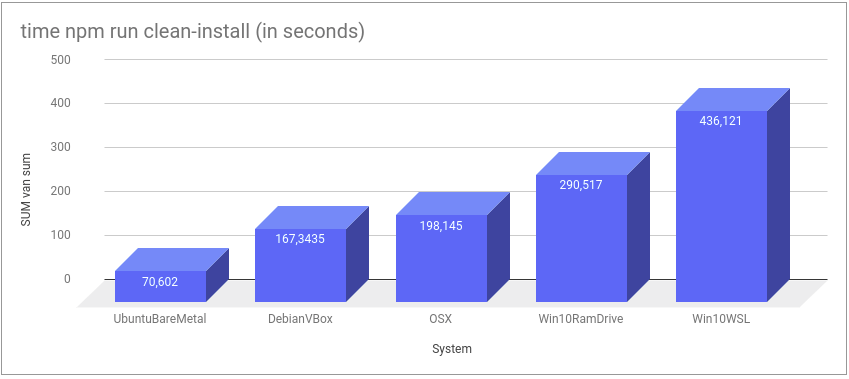

# Overview

[Table of Content](#table-of-content)

Last update: 08-NOV-2018 in the train from Eindhoven to Amsterdam. 

The objective for the exercise is two-fold;

1. Document every step to set up a full [Windows-based JavaScript full-stack environment using WSL](https://github.com/rkristelijn/wsl-mexn)
2. Benchmark agains [VirtualBox Debian full-stack Javascript environment](https://github.com/rkristelijn/debian-mexn)

## End result

[Table of Content](#table-of-content)

What you see below is two instances of bash on WSL running; one for the MongoDB, one for the API, on top that you see Visual Studio Code running on Windows, with also a integrated bash shell, running webpack for a simple [MEAN app](https://github.com/kristelijn/lean-mean).


## Executive Summary

Using only `npm start` it seems **both solutions perform practicly the same**. I still have to benchmark the performance of the application itself, as Windows still feels slow compared to the VBox Debian, and I have to compare the same on Linux-bare-metal, however I need to rerun all tests on a different box where I have full control on the harddisk. 

# Table of Content
- [Benchmark](#benchmark)
    - [Hardware info](#hardware-info)
    - [Versions](#versions)
    - [Result](#end-result)
- [Installation Guide](#installation-guide)
    - [Credits](#credits)
    - [Enabling WSL](#enabling-wsl)
    - [Installing Linux](#installing-linux)
    - [Installing Node.js](#installing-node.js)
    - [Installing MongoDB](#installing-mongodb)
    - [Developing](#developing)
- [References](#references)

# Benchmark

[Table of Content](#table-of-content)

**What am I testing?** - As we, as web developers, use webpack very often; I just tried to run npm start on my project [https://github.com/kristelijn/lean-mean](https://github.com/kristelijn/lean-mean) both on my VBox Debian install as the configuration below simultaniously, captured 10 runs each and calculated the average.



## Hardware info

[Table of Content](#table-of-content)

**Hardware** - HP Elitebook on Windows Enterprise (encrypted ssd)
systeminfo gives:
```
C:\Users\remi.kristelijn>systeminfo

Host Name:                 Lappie
OS Name:                   Microsoft Windows 10 Enterprise
OS Version:                10.0.17134 N/A Build 17134
OS Manufacturer:           Microsoft Corporation
OS Configuration:          Member Workstation
OS Build Type:             Multiprocessor Free
Registered Owner:          Owner
Registered Organization:   Owner
Product ID:                00xxx-00000-0000x-xxx
Original Install Date:     9-10-2018, 06:33:20
System Boot Time:          7-11-2018, 06:21:23
System Manufacturer:       HP
System Model:              HP EliteBook 820 G3
System Type:               x64-based PC
Processor(s):              1 Processor(s) Installed.
                           [01]: Intel64 Family 6 Model 78 Stepping 3 GenuineIntel ~2396 Mhz
BIOS Version:              HP N75 Ver. 01.29, 4-6-2018
Windows Directory:         C:\WINDOWS
System Directory:          C:\WINDOWS\system32
Boot Device:               \Device\HarddiskVolume2
System Locale:             nl;Dutch (Netherlands)
Input Locale:              en-us;English (United States)
Time Zone:                 (UTC+01:00) Amsterdam, Berlin, Bern, Rome, STable of Contentkholm, Vienna
Total Physical Memory:     8.069 MB
Available Physical Memory: 2.206 MB
Virtual Memory: Max Size:  12.421 MB
Virtual Memory: Available: 4.876 MB
Virtual Memory: In Use:    7.545 MB
Page File Location(s):     C:\pagefile.sys
Domain:                    Domain
Logon Server:              \\Server
Hotfix(s):                 5 Hotfix(s) Installed.
                           [01]: KB4100347
                           [02]: KB4287903
                           [03]: KB4456655
                           [04]: KB4462930
                           [05]: KB4462919
Network Card(s):           4 NIC(s) Installed.
                           [01]: VirtualBox Host-Only Ethernet Adapter
                                 Connection Name: VirtualBox Host-Only Network
                                 DHCP Enabled:    No
                                 IP address(es)
                                 [01]: 192.168.xxx.xxx
                                 [02]: fe80::cd57:ddee:xxxx:xxxx
                           [02]: Intel(R) Ethernet Connection I219-LM
                                 Connection Name: Ethernet
                                 Status:          Media disconnected
                           [03]: Intel(R) Dual Band Wireless-AC 8260
                                 Connection Name: Wi-Fi
                                 DHCP Enabled:    Yes
                                 DHCP Server:     192.168.x.x
                                 IP address(es)
                                 [01]: 192.168.xxx.xxx
                                 [02]: fe80::a9ff:5f59:xxxx:xxxx
                                 [03]: 2001:1c03:3d06:6f00:318a:b624:xxxx:xxxx
                                 [04]: 2001:1c03:3d06:6f00:a9ff:5f59:xxxx:xxxx
                           [04]: Bluetooth Device (Personal Area Network)
                                 Connection Name: Bluetooth Network Connection
                                 Status:          Media disconnected
Hyper-V Requirements:      VM Monitor Mode Extensions: Yes
                           Virtualization Enabled In Firmware: Yes
                           Second Level Address Translation: Yes
                           Data Execution Prevention Available: Yes
```

System | Performance (ms) 
--- | --- 
Win10 WSL	|	20552
VBoxDebian	|	20708
VBoxDebian	|	20345
VBoxDebian	|	19125
VBoxDebian	|	20649
Win10 WSL	|	19401
Win10 WSL	|	20807
VBoxDebian	|	22796
Win10 WSL	|	19829
VBoxDebian	|	22393
Win10 WSL	|	18799

Result from [https://gist.github.com/noygal/6b7b1796a92d70e24e35f94b53722219](https://gist.github.com/noygal/6b7b1796a92d70e24e35f94b53722219), but looking at the above I can't validate them also it seems noygal uses different systems to benchmark and or it could be that the performance today seems better than in 2017.

System | Performance 
--- | --- 
Mac Mini 2012 Core i5 10GB RAM | 217.6 sec 
Windows WSL | 335 sec
Linux Mint Bare Metal | 182.4 sec
VirtualBox | 124 sec

## Versions

[Table of Content](#table-of-content)

Item | Version
--- | ---
MongoDB | 4.0 Community Edition
NPM | 6.4.1
Node | 11.1.0
WSL | Windows 10 Enterprise OS v 1803 build 17134.345
vscode | 1.18.2
git | v2.11.0
gitkraken | 4.0.6
Linux | Debian GNU/Linux 9 (stretch)

# Installation guide

[Table of Content](#table-of-content)


## Credits

[Table of Content](#table-of-content)

This post is a copy of [https://gist.github.com/noygal/6b7b1796a92d70e24e35f94b53722219](https://gist.github.com/noygal/6b7b1796a92d70e24e35f94b53722219) however tailored to run mexn (MongoDB, Express, (Angular/React/Vue/DHTMLX/Whatever) and Node) and compared to Debian instead of Ubuntu

## Windows 10 Fall Creators Update - Installing Node.js on Windows Subsystem for Linux (WSL)

Windows just (11-07-2016) released the [windows subsystem for linux](https://msdn.microsoft.com/en-us/commandline/wsl/about) feature to the public with its latest windows fall creator update, if you are not familiar with this feature it allows you to run linux binaries natively on windows - [F.A.Q](https://msdn.microsoft.com/en-us/commandline/wsl/faq).

## Enabling WSL

[Table of Content](#table-of-content)

The feature is not enabled by default and you need to activate it, you can do it via powershell (with admin rights):
```
Enable-WindowsOptionalFeature -Online -FeatureName Microsoft-Windows-Subsystem-Linux
```
Or you can open: Control-Panel -> Programs -> Turn Windows feature on ro off, and click the "windows subsystem for linux (beta)" button.

Now to install your linux version, again two options, you can either install from Windows store (search linux) or you can turn on developer mode and open it via the command line:
Open Settings -> Update and Security -> For developers, and Select the "Developer Mode" radio button.

## Installing Linux

[Table of Content](#table-of-content)

For those who are not familiar with linux, fragmentation if part of the fun and there a lot of linux distributions and package management systems for it, the default installation in WSL is ubuntu and I recommend to keep it as it one of the most popular distribution around. If you need different distribution the easiest why is to install it from the windows store.

Search for Linux, you can use any distro, but I use Debian (Ubuntu is derived from Debian)

Run CMD.exe and type:
```
bash
```

When you first run the command you'll encounter the cli based installer wizard, the ubuntu image will automatically download and you'll be prompt to enter username and password. If you found yourself in need to reset/reinstall the ubuntu machine you can use `lxrun.exe`:
```
CMD> lxrun
Performs administrative operations on the LX subsystem

Usage:
    /install - Installs the subsystem
        Optional arguments:
            /y - Do not prompt user to accept
    /uninstall - Uninstalls the subsystem
        Optional arguments:
            /full - Perform a full uninstall
            /y - Do not prompt user to accept
    /setdefaultuser - Configures the subsystem user that bash will be launched as. If the user does not exist it will be created.
        Optional arguments:
            username - Supply the username
            /y - If username is supplied, do not prompt to create a password
    /update - Updates the subsystem's package index
```

That's it, you're running debian on windows!

[reference](https://msdn.microsoft.com/en-us/commandline/wsl/install_guide)

## Installing Node.js

[Table of Content](#table-of-content)

First We'll start by updating linux, for those of you that are not familiar with linux this require running the process as `root` by add the `sudo` command before the command we need to execute:
```
sudo apt-get update
sudo apt-get upgrade
```
You'll need to enter your user password to proceed, if you prompt just press y (or yes) to continue.

If you don't want to type the password every single time when you need to use sudo, then better you add the following line (at the end) to `sudo visudo`: (replace `username` with your username)

```
username    ALL=(ALL:ALL) NOPASSWD:ALL
```

We also need to install some basic build tool for [node-gyp](https://github.com/nodejs/node-gyp) - node binaries build tool.
```
sudo apt-get install build-essential
```

I do not recommend on the "official" to install node, node rapid development life cycle (and the entire ecosystem for that matter) leads more then often for the need to have tight control over the node binaries version, or more likely to have to project running on different versions of node (such as [LTS](https://github.com/nodejs/Release) versions).

Before we can continue, we need `curl`:
```
sudo apt-get install curl
```

[NVM](https://github.com/creationix/nvm) tool gives you the ability to install and use multiple version of node, and prevent the (bad) usage of `sudo` for running node application, installation is via the command line:
```
curl -o- https://raw.githubusercontent.com/creationix/nvm/v0.33.5/install.sh | bash
```
Restart your terminal after install.

Now just install the latest the latest stable version of node:
```
nvm install stable
```
To update node just run the command again.

One thing you'll have to remember when use NVM is that you'll need to explicitly specify the node version you want to use (installing does it automatically on the end of the install), so next time you'll login to ubuntu you'll need to run the command:
```
nvm use stable
```

# Installing MongoDB

[Table of Content](#table-of-content)

Note: if you are using a different distro than Debian, look for the right key and list [here](https://docs.mongodb.com/manual/tutorial/install-mongodb-on-debian/)
```bash
sudo apt-get install dirmngr apt-transport-https
sudo apt-key adv --keyserver hkp://keyserver.ubuntu.com:80 --recv 9DA31620334BD75D9DCB49F368818C72E52529D4
echo "deb http://repo.mongodb.org/apt/debian stretch/mongodb-org/4.0 main" | sudo tee /etc/apt/sources.list.d/mongodb-org-4.0.list
sudo apt-get install -y mongodb-org
sudo mkdir -p data/db
```

To start your database, open up a new bash shell and type
```
sudo mongod --dbpath ~/data/db
```

Now in your original shell you can type
```bash
gius@my-awesome-machine-name:~$ mongo
MongoDB shell version v4.0.4
connecting to: mongodb://127.0.0.1:27017
/** blablabla **/
---

> show dbs;
admin   0.000GB
config  0.000GB
local   0.000GB
> exit
bye
```

## Developing

[Table of Content](#table-of-content)

Your windows hard disk drivers are mounted in linux under `/mnt/<drive letter>/` so you can access any folder via linux and run whatever command you need in order to get your project up and running, missing needed tools can be installed via `npm` or `apt-get` for system tools.

IDE terminal integration support is still on its early days, [vscode](https://code.visualstudio.com/) offers support with minimal configuration, [guide](https://code.visualstudio.com/docs/editor/integrated-terminal). If your IDE just point to the executable (like cmd.exe) check if you can point it to `c:\Windows\System32\bash.exe`.

In Visual Studio, hit settings in JSON format and add:
```json
{
    "terminal.integrated.shell.windows": "C:\\WINDOWS\\System32\\bash.exe"
}
```

# Check ports
I'm used to type `sudo netstat -lptn` to see if ports are already opened or if my server is running. You need to run
```bash
sudo apt-get install net-tools
```
... to install them

Oddly, when I run it, It doesn't show the ports of other bash instances. I could investigate more using `forever` to get my shell back after I start node and see if I see something, but that is a bit besides the point of checking if ports are already in use by another process.

```
gius@CPX-E9RIC6CL6SP:/mnt/c/Users/remi.kristelijn$ sudo netstat -lptn
Active Internet connections (only servers)
Proto Recv-Q Send-Q Local Address           Foreign Address         State       PID/Program name
gius@CPX-E9RIC6CL6SP:/mnt/c/Users/remi.kristelijn$
```


# References

[Table of Content](#table-of-content)

* [https://daverupert.com/2018/04/developing-on-windows-with-wsl-and-visual-studio-code/](https://daverupert.com/2018/04/developing-on-windows-with-wsl-and-visual-studio-code/) - post WSL settings for WebDev
* [http://www.akitaonrails.com/2017/09/20/windows-subsystem-for-linux-is-good-but-not-enough-yet](http://www.akitaonrails.com/2017/09/20/windows-subsystem-for-linux-is-good-but-not-enough-yet) - performance benchmark between Windows-host-VirtualBox-Linux-Guest, Bare-metal-Linux, Windows-native, Windows-WSL and Mac 
* [https://github.com/adam-p/markdown-here/wiki/Markdown-Cheatsheet](https://github.com/adam-p/markdown-here/wiki/Markdown-Cheatsheet) 
* [https://github.com/Microsoft/WSL/issues/796](https://github.com/Microsoft/WSL/issues/796) issues with WSL and MongoDB and the solution: [https://gist.github.com/Mikeysax/cc86c30903727c556bcce960f7e4d59b](https://gist.github.com/Mikeysax/cc86c30903727c556bcce960f7e4d59b)
* Get to the version of WSL [https://github.com/Microsoft/WSL/issues/1728](https://github.com/Microsoft/WSL/issues/1728)
